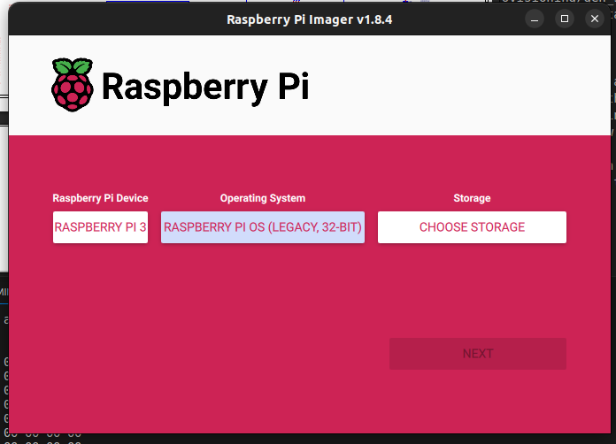
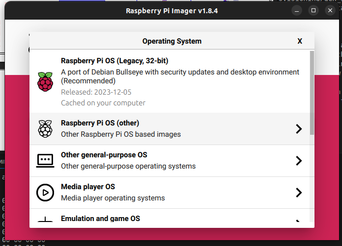

# README

This codebase is intended to use with the NXP `blhost` tool.  In this instance, a Raspberry Pi 3B+ is used to communicate with an NXP RT685-EVK.
The EVK is setup as described below so that the host (the Raspberry Pi) can toggle the necessary pins and the process can proceed without
user intervention.

## The Raspberry Pi

The Raspberry Pi is loaded with the latest version of Raspian, Bullseye.  This uses version 3.9 of Python and version 2.01 of the NXP SPSDK.
Since the Raspberry Pi does not contain onboard flash, the user must supply a microSD which can be used with the Raspberry Pi.  To image
the SD, the simplest way to proceed is by using the [imager provided by Raspberry Pi](https://www.raspberrypi.com/software/).  The image chosen
for this implementation was the Bullseye.  The imager selection is shown below





When the image is installed, update the system using the following:

```
sudo apt update
sudo apt upgrade -y
sudo apt install rpi.gpio
```

If there is any difficulty with the network, the IP address may have to be changed according to the interface or SSID.  This can be done by right clicking
on the desktop icon for the wireless network in the top right corner and setting the IP address appropriately.

### Raspberry PI GPIO

The last install command above will install the python scripts for interacting with the onboard GPIO.  The script provided uses to GPIO on the board to 1)
reset the EVK and 2) toggle the ISP pin.  The pin layout on the Raspberry Pi 3B is as follows:


For this application, we are using the GPIO pins located pins 3 and 5.  In the application, the BCM numbering is used where pin 3 is referred to as GPIO 2 and
is used to toggle the ISP line and pin 5 is GPIO 3 and is used to toggle the reset line.

### The Secure Provisioning Toolkit

NXP provides a set of python scripts to communicate with the bootloader via a host such as a PC or an SoC.  The application, called blhost,
is provided with the [secure provisioning SDK](https://spsdk.readthedocs.io/en/latest/spsdk.html), described as a "unified, reliable, and easy
to use Python SDK library".

To install the SDK on the Raspberry Pi, run the following in a terminal to 1) create a Python virtual environment and 2) install the secure
provisioning toolkit (SPSDK):

```
python3 -m venv .venv
source .venv/bin/activate
python -m pip install --upgrade pip
pip install spsdk
```

Once the scripts are installed and the virtual environment has been activated, the `blhost` command can be used directly from the command line to
communicate with ROM bootloader once the ISP pins are configured properly.

## ISP Pin Settings

Given the correct `BOOT_CFG` register settings, the system will boot based upon the in-system programming pins ISP0-2.
The proper setting for the 4 bits in `BOOT_CFG` to boot from the ISP pins is 0x0. The pins for ISP are defined as
follows:

* ISP0 - PIO1_15
* ISP1 - PIO1_16
* ISP2 - PIO1_17

The default setting of the Audio EVK and the standard EVK is to boot from FlexSPI Port B.  The two settings for the
 ISP pins relevant to our application are as follows:

| Setting | ISP0 | ISP1 | ISP2 |
| ------- | ---- | ---- | ---- |
| Default |  0   |  1   |  0   |
| UART    |  0   |  1   |  1   |

Unfortunately, the only pin that needs to be toggled is ISP2 and this pin is not available on any header.  **For access to
ISP2**, bring the ground side out of the ISP2 pin.  The diagram below is from the RT685 EVK drawings and shows the layout
and connections of SW5.  Place the line that will be pulled out closest to R95 and set the position of switch 3 to the
ON position (the default position).


## Scripting the Bootloader Interaction

The script communicates with the ROM bootloader via the Python scripts provided by the SPSDK. The serial communication is
configured to run at 921.6 kbaud.  The repo provides an image that when booted into, allows the user to toggle the blue LED
using SW2.  In order to properly load the SPL or any other application via blhost python script:

1. Hold MCU in reset.  On the EVK, the reset pin can be routed to the Arduino header J29 pin 3.  The signal is routed to
the header by shorting JP14.
2. Set the pinout for ISP 2 from the default low to high.  This pin is not available via any header on either EVK so the
pin will have to be brought out likely from SW5.
3. Release reset.
4. Begin programming from via UART.  I have chosen J5 which which is also routed through the USART header J16.  This is
the USART port used by ISP mode FlexComm 0.  In order to use J16, disable the connection to the Link2 proble on J5 by
shorting pins 2-3 on JP21.
5. Hold system in reset.
6. Set ISP2 back to it's default setting of low.
7. Release reset.

After this process, the system should boot into the application that has been flashed.

When running the script, the flash config block (FCB) has to be properly configured so that the MCU can access the memory
located there.  After successfully configuring the block, the FCB is printed to screen and should look like the following:

```
FCB
==============================
46 43 46 42 00 04 01 56 00 00 00 00 00 03 03 00
01 00 01 00 01 06 00 00 00 00 00 00 01 00 02 00
01 07 00 00 01 0A 00 00 00 00 00 00 00 00 00 00
02 00 00 00 01 00 00 00 00 00 00 00 00 00 00 00
50 00 00 00 01 08 07 00 00 00 00 00 00 00 00 00
00 00 00 00 00 00 00 00 00 00 00 04 00 00 00 00
00 00 00 00 00 00 00 00 00 00 00 00 00 00 00 00
00 00 00 00 00 00 00 00 00 00 00 00 00 00 00 00
EC 07 13 07 20 0B 14 33 04 27 00 00 00 00 00 00
05 04 04 24 00 00 00 00 00 00 00 00 00 00 00 00
05 07 FA 07 20 0B 14 33 04 27 00 00 00 00 00 00
06 04 00 00 00 00 00 00 00 00 00 00 00 00 00 00
06 07 F9 07 00 00 00 00 00 00 00 00 00 00 00 00
21 07 DE 07 20 0B 00 00 00 00 00 00 00 00 00 00
72 04 00 04 00 04 03 04 00 04 01 20 00 00 00 00
72 04 00 04 00 04 02 04 00 04 01 20 00 00 00 00
DC 07 23 07 20 0B 00 00 00 00 00 00 00 00 00 00
12 07 ED 07 20 0B 04 23 00 00 00 00 00 00 00 00
72 04 00 04 00 04 00 04 00 04 01 20 00 00 00 00
60 07 9F 07 00 00 00 00 00 00 00 00 00 00 00 00
00 00 00 00 00 00 00 00 00 00 00 00 00 00 00 00
00 00 00 00 00 00 00 00 00 00 00 00 00 00 00 00
00 00 00 00 00 00 00 00 00 00 00 00 00 00 00 00
00 00 00 00 00 00 00 00 00 00 00 00 00 00 00 00
00 00 00 00 00 00 00 00 00 00 00 00 00 00 00 00
00 00 00 00 00 00 00 00 00 00 00 00 00 00 00 00
00 00 00 00 00 00 00 00 00 00 00 00 00 00 00 00
00 00 00 00 00 00 00 00 00 00 00 00 00 00 00 00
00 01 00 00 00 10 00 00 01 00 00 00 02 00 00 00
00 00 01 00 00 81 00 07 00 00 00 00 00 00 00 00
00 00 00 00 00 00 00 00 00 00 00 00 00 00 00 00
00 00 00 00 00 00 00 00 00 00 00 00 00 00 00 00
```

If the application is succefully written to, then the user should see at the end message "Flash successfully written to...".

The application(s) provided were built using the MCUXpresso IDE provided by NXP as described in the _MCUXpresso Secure Provising Tool User Guide_.

1. Set `BOOT_HEADER_ENABLE` to 0.
2. Build image.  The image built will result in an axf file.
3. Use the axf with a start address of `0x80000` and build the image in the MCUXpresso Secure Provisioning application as show below


Once the image is built into a binary, this can be written to the proper place in flash using the script provided.

